A block is a kind of scene: a title card, a code window, a chart, a diagram.
Fourteen ship with stingo, and adding a fifteenth is one file.

```bash
stingo blocks            # what is registered, with every field
stingo blocks chart      # just one
```

## The set

Every frame below is rendered from the real pipeline by
`bun run tools/gallery.ts`, so the gallery cannot drift from what the code does.

<div class="gallery">
  <figure>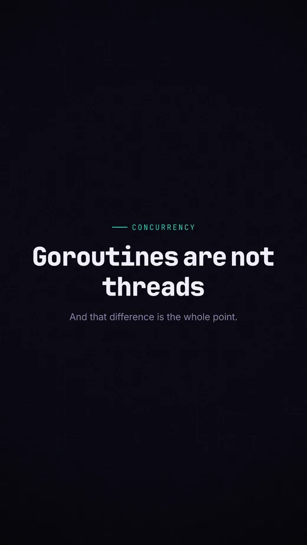<figcaption>title</figcaption></figure>
  <figure>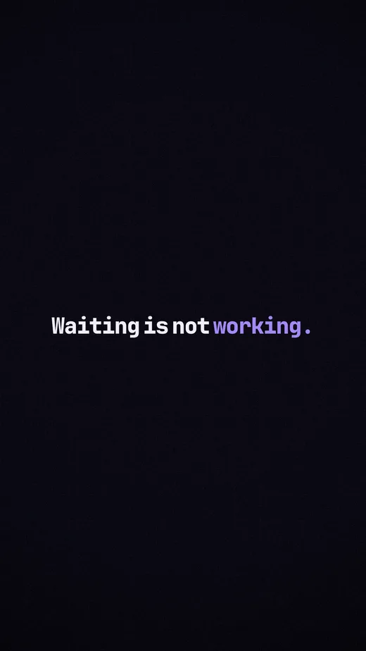<figcaption>statement</figcaption></figure>
  <figure>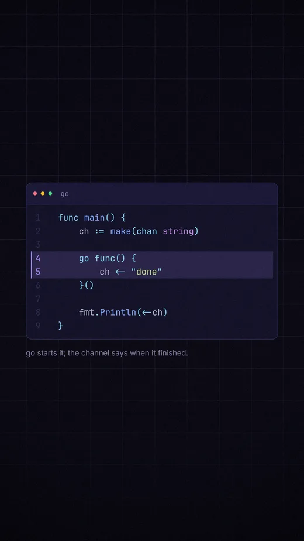<figcaption>code</figcaption></figure>
  <figure>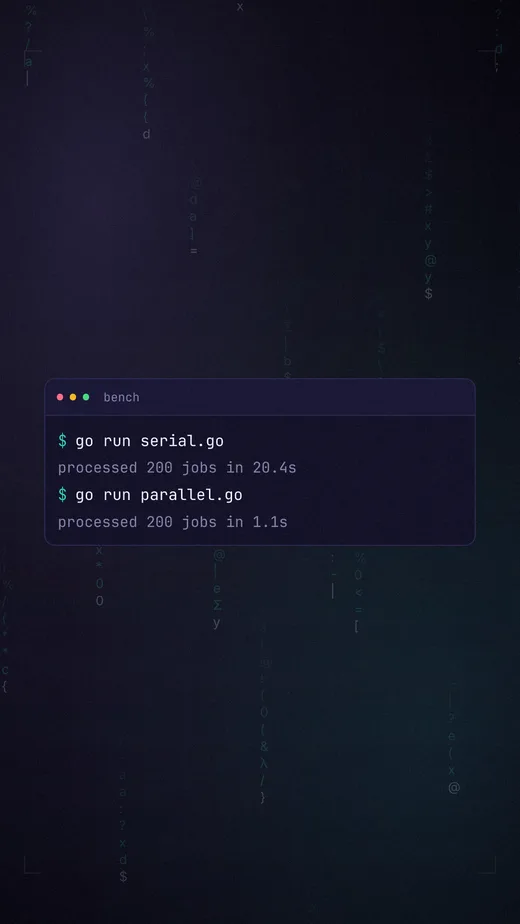<figcaption>terminal</figcaption></figure>
  <figure>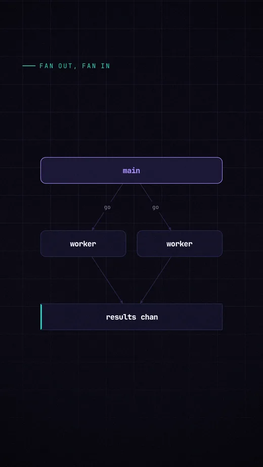<figcaption>diagram</figcaption></figure>
  <figure>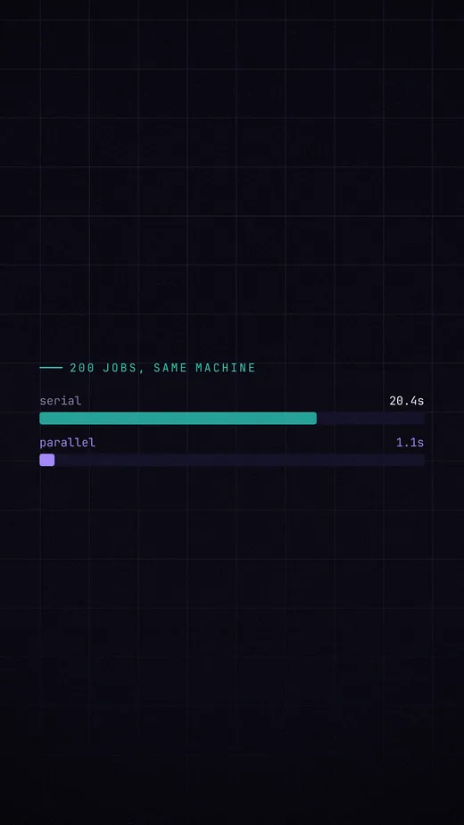<figcaption>chart</figcaption></figure>
  <figure>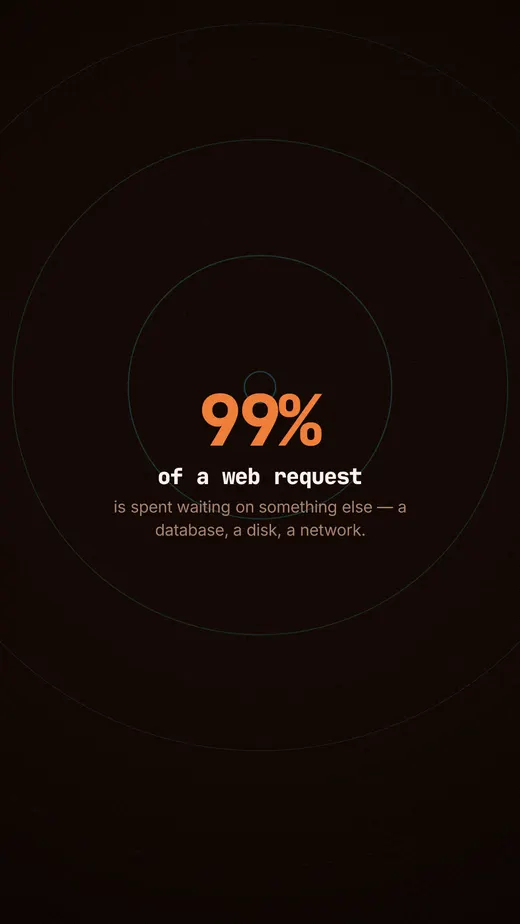<figcaption>stat</figcaption></figure>
  <figure>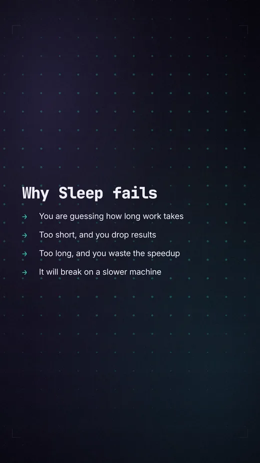<figcaption>list</figcaption></figure>
  <figure>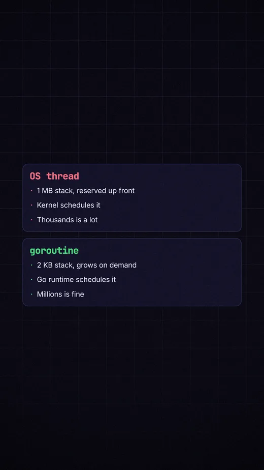<figcaption>compare</figcaption></figure>
  <figure><figcaption>quote</figcaption></figure>
  <figure>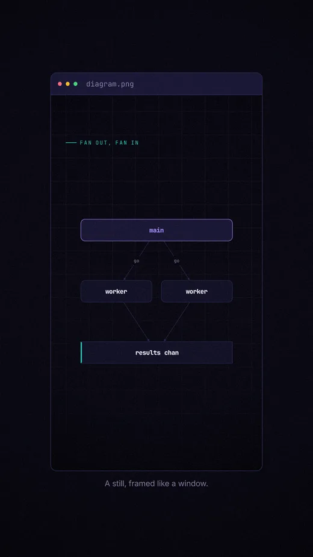<figcaption>image</figcaption></figure>
  <figure>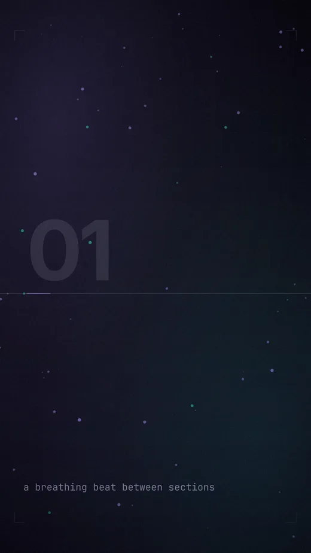<figcaption>broll</figcaption></figure>
  <figure><figcaption>camera</figcaption></figure>
  <figure>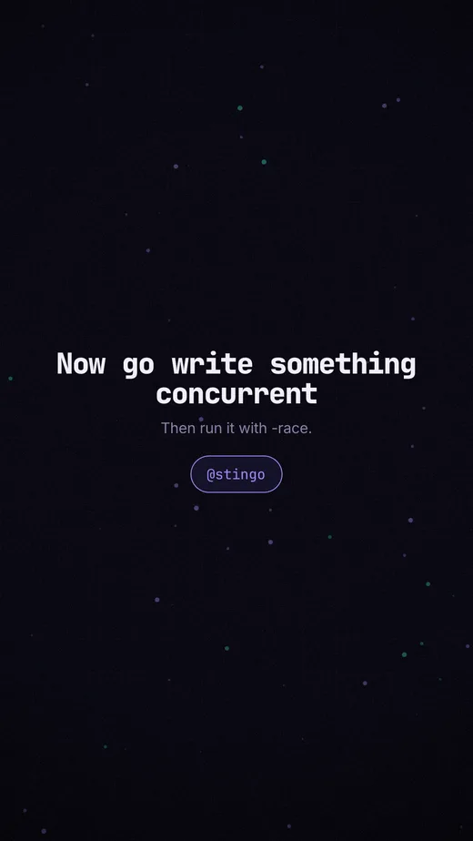<figcaption>outro</figcaption></figure>
</div>

Captions are an overlay rather than a block — any scene with a `say` field gets
them:

<div class="gallery">
  <figure>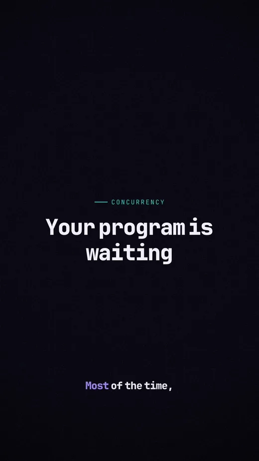<figcaption>captions</figcaption></figure>
</div>

## Every block

<!-- generated: blocks — bun run tools/blockdocs.ts -->

### title

A headline with an optional kicker and subtitle.

<figure class="wide"></figure>

| field | type | default |
|---|---|---|
| `text` | `string` | **yes** |
| `kicker` | `string` | — |
| `sub` | `string` | — |
| `align` | `left` \| `center` | `"center"` |

4.5s by default. Background defaults to `beams`.

```yaml
scenes:
  - block: title
    kicker: concurrency
    text: Goroutines are not threads
    sub: And that difference is the whole point.
```

### statement

One sentence, large, with optional words picked out in the accent.

<figure class="wide"></figure>

| field | type | default |
|---|---|---|
| `text` | `string` | **yes** |
| `emphasis` | array of `string` | `[]` |

4s by default. Background defaults to `mesh`.

```yaml
scenes:
  - block: statement
    text: Waiting is not working.
    emphasis: [ working. ]
```

### code

Syntax-highlighted source in a window frame, revealed line by line.

<figure class="wide"></figure>

| field | type | default |
|---|---|---|
| `lang` | `string` | `"ts"` |
| `code` | `string` | — |
| `file` | `string` | — |
| `highlight` | array of `number` | `[]` |
| `caption` | `string` | — |
| `reveal` | `all` \| `lines` \| `typewriter` | `"lines"` |

8s by default, longer as the content grows. Background defaults to `grid`.

```yaml
scenes:
  - block: code
    lang: go
    code: |-
      func main() {
          ch := make(chan string)

          go func() {
              ch <- "done"
          }()

          fmt.Println(<-ch)
      }
    highlight: [ 4, 5 ]
    caption: go starts it; the channel says when it finished.
```

### terminal

A shell session: commands type themselves in, output follows.

<figure class="wide"></figure>

| field | type | default |
|---|---|---|
| `lines` | array of `{ prompt, cmd, out, delay }` | **yes** |
| `title` | `string` | `"bash"` |

9s by default, longer as the content grows. Background defaults to `codeRain`.

```yaml
scenes:
  - block: terminal
    title: bench
    lines:
      - prompt: $
        cmd: go run serial.go
        out: processed 200 jobs in 20.4s
      - prompt: $
        cmd: go run parallel.go
        out: processed 200 jobs in 1.1s
```

### diagram

Boxes and arrows on an explicit grid — architecture, data flow, state.

<figure class="wide"></figure>

| field | type | default |
|---|---|---|
| `title` | `string` | — |
| `nodes` | array of `{ id, label, at, kind, span, note, accent }` | **yes** |
| `edges` | array of `{ from, to, label, style, bend, both, accent }` | `[]` |

5s by default, longer as the content grows. Background defaults to `grid`.

```yaml
scenes:
  - block: diagram
    title: fan out, fan in
    nodes:
      - id: main
        label: main
        at: [ 0, 0 ]
        span: 2
        accent: true
      - id: w1
        label: worker
        at: [ 0, 1 ]
      - id: w2
        label: worker
        at: [ 1, 1 ]
      - id: ch
        label: results chan
        at: [ 0, 2 ]
        span: 2
        kind: queue
    edges:
      - from: main
        to: w1
        label: go
      - from: main
        to: w2
        label: go
      - from: w1
        to: ch
      - from: w2
        to: ch
```

### chart

An animated bar or line chart.

<figure class="wide"></figure>

| field | type | default |
|---|---|---|
| `kind` | `bar` \| `line` | `"bar"` |
| `title` | `string` | — |
| `data` | array of `{ label, value }` | **yes** |
| `unit` | `string` | `""` |
| `highlightIndex` | `number` | — |

7s by default, longer as the content grows. Background defaults to `grid`.

```yaml
scenes:
  - block: chart
    kind: bar
    title: 200 jobs, same machine
    unit: s
    data:
      - label: serial
        value: 20.4
      - label: parallel
        value: 1.1
    highlightIndex: 1
```

### stat

One big number that counts up, with a label.

<figure class="wide"></figure>

| field | type | default |
|---|---|---|
| `value` | `string` | **yes** |
| `label` | `string` | **yes** |
| `sub` | `string` | — |
| `countFrom` | `string` | — |

4.5s by default. Background defaults to `pulse`.

```yaml
scenes:
  - block: stat
    value: 18x
    label: faster
    sub: Same CPU. It simply stopped waiting in line.
```

### list

Bulleted points that arrive one at a time.

<figure class="wide"></figure>

| field | type | default |
|---|---|---|
| `title` | `string` | — |
| `items` | array of `string` | **yes** |
| `marker` | `num` \| `dot` \| `arrow` \| `check` | `"arrow"` |

7s by default, longer as the content grows. Background defaults to `dots`.

```yaml
scenes:
  - block: list
    title: Why Sleep fails
    marker: arrow
    items:
      - You are guessing how long work takes
      - Too short, and you drop results
      - Too long, and you waste the speedup
      - It will break on a slower machine
```

### compare

Two columns set against each other.

<figure class="wide"></figure>

| field | type | default |
|---|---|---|
| `left` | object `{ title, items }` | **yes** |
| `right` | object `{ title, items }` | **yes** |

7.5s by default, longer as the content grows. Background defaults to `grid`.

```yaml
scenes:
  - block: compare
    left:
      title: OS thread
      items:
        - 1 MB stack, reserved up front
        - Kernel schedules it
        - Thousands is a lot
    right:
      title: goroutine
      items:
        - 2 KB stack, grows on demand
        - Go runtime schedules it
        - Millions is fine
```

### quote

A pull quote with an attribution.

<figure class="wide"></figure>

| field | type | default |
|---|---|---|
| `text` | `string` | **yes** |
| `attrib` | `string` | — |

6s by default. Background defaults to `mesh`.

```yaml
scenes:
  - block: quote
    text: Do not communicate by sharing memory; share memory by communicating.
    attrib: Rob Pike
```

### image

A still — screenshot, photo or diagram — with an optional frame and caption.

<figure class="wide"></figure>

| field | type | default |
|---|---|---|
| `src` | `string` | **yes** |
| `fit` | `contain` \| `cover` | `"contain"` |
| `frame` | `none` \| `plain` \| `window` | `"plain"` |
| `title` | `string` | — |
| `kicker` | `string` | — |
| `caption` | `string` | — |
| `drift` | `number` | `0.05` |

5s by default. Background defaults to `mesh`.

```yaml
scenes:
  - block: image
    src: ./diagram.png
    frame: window
    title: diagram.png
    caption: A still, framed like a window.
```

### broll

A breathing beat: background only, with an optional caption.

<figure class="wide"></figure>

| field | type | default |
|---|---|---|
| `caption` | `string` | — |

3.5s by default. Background defaults to `particles`.

```yaml
scenes:
  - block: broll
    caption: a breathing beat between sections
    bg:
      kind: particles
      opacity: 0.8
```

### camera

A recorded take composited into the scene — full frame, corner pip, or split.

<figure class="wide"></figure>

| field | type | default |
|---|---|---|
| `camera` | object `{ src, from, layout, fit, zoom, offsetX, offsetY, mirror, corner, size, aspect, shape, margin, side, ratio, ring, scrim, mute, gainDb }` | **yes** |
| `caption` | `string` | — |
| `lower` | object `{ name, role }` | — |

8s by default, longer as the content grows, and exempt from the pacing clamp. Background defaults to `none`.

```yaml
scenes:
  - block: camera
    camera:
      src: takes/01.mp4
      layout: pip
    lower:
      name: Your name
      role: the person explaining
```

### outro

Closing card with a handle or call to action.

<figure class="wide"></figure>

| field | type | default |
|---|---|---|
| `text` | `string` | **yes** |
| `sub` | `string` | — |
| `handle` | `string` | — |

5s by default. Background defaults to `particles`.

```yaml
scenes:
  - block: outro
    text: Now go write something concurrent
    sub: Then run it with -race.
    handle: "@stingo"
```

<!-- /generated -->

## Adding one

A block declares its own fields, how long it wants to be on screen, what plays
behind it, and how to draw itself. Importing the file is what registers it —
there is no list to add yourself to, and nothing central to edit.

```ts
// packages/blocks/src/countdown.ts
import { z } from 'zod';
import { defineBlock } from './define';
import { box, text } from '@stingo/render';
import { typeStyle } from './ctx';
import { T } from './stage';
import { lifecycle } from './anim';

export default defineBlock({
  name: 'countdown',
  describe: 'A number ticking down to zero.',

  // block-specific fields. The base fields — id, dur, at, bg, enter, exit,
  // say, camera, cut — are added for you.
  fields: {
    from: z.number().int().default(3),
    label: z.string().optional(),
  },

  // base is a floor, not a fallback: a content estimate can push past it,
  // narration replaces it, and the taste's pacing bounds clamp the result.
  duration: { base: 4, estimate: (s) => 0.8 + s.from * 0.9 },

  // what plays behind, when the scene does not say
  broll: { kind: 'pulse', opacity: 0.5 },

  render: (s, c) => {
    const n = Math.max(0, s.from - Math.floor(c.t));
    return box(
      { width: c.stage.w, height: c.stage.h, flexDirection: 'column',
        alignItems: 'center', justifyContent: 'center', gap: c.stage.unit },
      text({ ...typeStyle(c, 'display', T.huge(c.stage), c.taste.palette.accent) }, String(n)),
      s.label
        ? text({ ...typeStyle(c, 'body', T.body(c.stage), c.taste.palette.muted),
                 ...lifecycle(c.t, c.dur, c.taste, 'fade', 0.2) }, s.label)
        : null,
    );
  },
});
```

Add `import './countdown';` to `packages/blocks/src/registry.ts` so the built-in
set picks it up, and it works everywhere at once — in YAML, in the planner, in
the preview, in `stingo blocks`:

```yaml
- block: countdown
  from: 5
  label: until launch
```

## What `render` receives

`render(scene, ctx)` is a **pure function of time**. It must not depend on any
previous frame: `framePixels(4821)` is called without frame 4820 ever existing.
That is what makes scrubbing, parallel rendering and deterministic output work.

`scene` is your fields plus the base ones, already validated and defaulted.

`ctx` carries:

| | |
|---|---|
| `t` | seconds since this scene started |
| `dur` | how long the scene runs |
| `abs` | seconds since the film started |
| `stage` | `w`, `h`, `unit`, `padX/padY`, `orientation` — size from these, never from raw pixels |
| `taste` | the resolved profile: palette, type, motion, texture |
| `grid` | the beat grid, for anything that should land on the music |
| `index` | scene number, useful as a deterministic seed |
| `family` | resolve a font family name against what is actually loaded |
| `fit` | the largest size at or below one you ask for at which text fits a box |
| `tokens` | the words that will actually be laid out, already broken to fit |

satori will not shrink text to fit, so a block that renders a headline without
asking `fit` for a size is a block that can run it off the edge of the frame.

Size everything from `stage.unit` and the `T.*` scale. That is what lets one
composition render at 1080×1920 and 1920×1080 without a second layout.

## A typed builder

The YAML path works as soon as the block is registered. To use it from
TypeScript, add a builder beside it:

```ts
class CountdownBuilder extends SceneBuilder<CountdownBuilder> {
  label(v: string) { this.s.label = v; return this; }
}
export const countdown = (from: number) =>
  new CountdownBuilder({ block: 'countdown', from });
```

```ts
countdown(5).label('until launch').bg('pulse')
```

## Blocks from outside the repo

`defineBlock` is exported from the package, so a block does not have to live
here:

```ts
import { defineBlock } from '@hersidev/stingo';
export default defineBlock({ name: 'myblock', /* … */ });
```

Import it before you render, and the Scene schema, the planner and the
compositor all pick it up. Names must be unique; registering an existing name
replaces it, which is how you override a built-in.
