Everything on this page was rendered by stingo, and regenerated by one command:

```bash
bun run tools/gallery.ts
```

Nothing here is a mockup or a screenshot taken by hand. If a frame below looks
wrong, that is what the current code produces — which is the point of generating
it rather than curating it.

## The demo

<figure class="demo">
  <video src="../assets/video/demo.mp4" poster="../assets/img/demo-poster.webp"
         controls loop playsinline preload="metadata"
         aria-label="A rendered stingo film with narration and music."></video>
  <figcaption>Fifty seconds, cut to a 128 BPM track. Unmute it.</figcaption>
</figure>

## Blocks

Fourteen kinds of scene. Full field reference on the [blocks](blocks) page.

<div class="gallery">
  <figure><figcaption>broll</figcaption></figure>
  <figure><figcaption>camera</figcaption></figure>
  <figure><figcaption>chart</figcaption></figure>
  <figure><figcaption>code</figcaption></figure>
  <figure><figcaption>compare</figcaption></figure>
  <figure><figcaption>diagram</figcaption></figure>
  <figure><figcaption>image</figcaption></figure>
  <figure><figcaption>list</figcaption></figure>
  <figure><figcaption>outro</figcaption></figure>
  <figure><figcaption>quote</figcaption></figure>
  <figure><figcaption>stat</figcaption></figure>
  <figure><figcaption>statement</figcaption></figure>
  <figure><figcaption>terminal</figcaption></figure>
  <figure><figcaption>title</figcaption></figure>
</div>

Captions are an overlay rather than a block — any scene with a `say` field gets
them, and the spoken word is picked out as it lands.

<div class="gallery">
  <figure><figcaption>captions</figcaption></figure>
</div>

## B-roll

Eleven generators — plus `none`, which has nothing to show. Deterministic from
a seed, no footage required. Set `bg: { kind: … }` on any scene, or give `bg` a
`src` and play your own media instead.

<div class="gallery">
  <figure>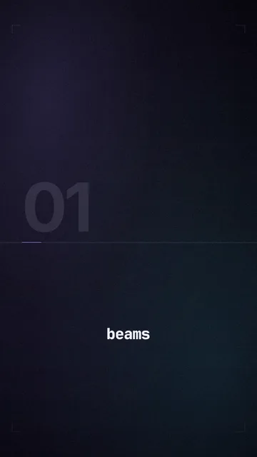<figcaption>beams</figcaption></figure>
  <figure>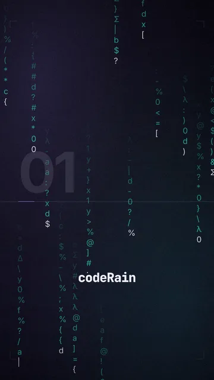<figcaption>codeRain</figcaption></figure>
  <figure>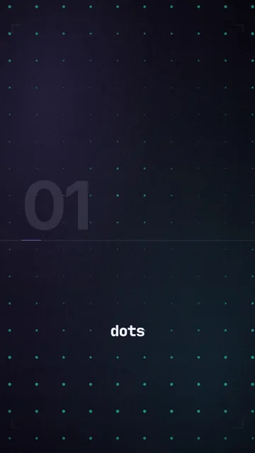<figcaption>dots</figcaption></figure>
  <figure>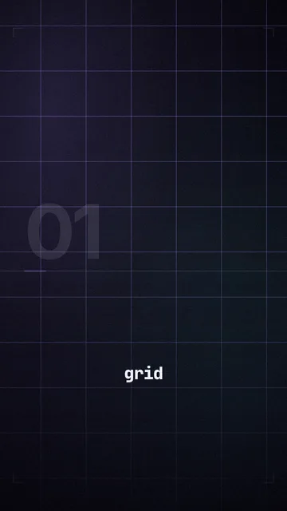<figcaption>grid</figcaption></figure>
  <figure><figcaption>mesh</figcaption></figure>
  <figure>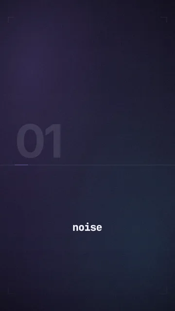<figcaption>noise</figcaption></figure>
  <figure>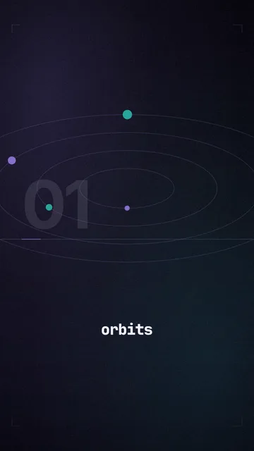<figcaption>orbits</figcaption></figure>
  <figure>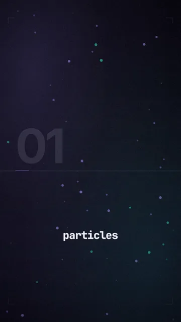<figcaption>particles</figcaption></figure>
  <figure>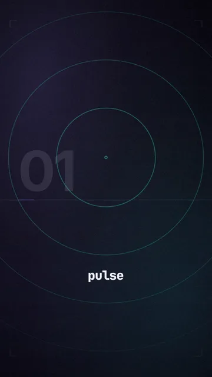<figcaption>pulse</figcaption></figure>
  <figure>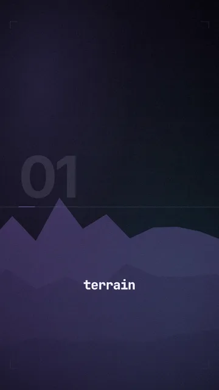<figcaption>terrain</figcaption></figure>
  <figure>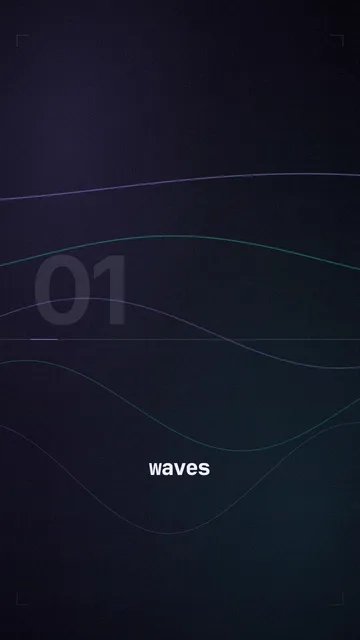<figcaption>waves</figcaption></figure>
</div>

## Taste

The same scene under three profiles. Only the taste file changed.

<div class="gallery">
  <figure>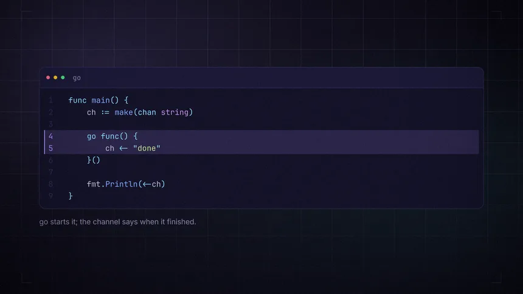<figcaption>bootdev</figcaption></figure>
  <figure>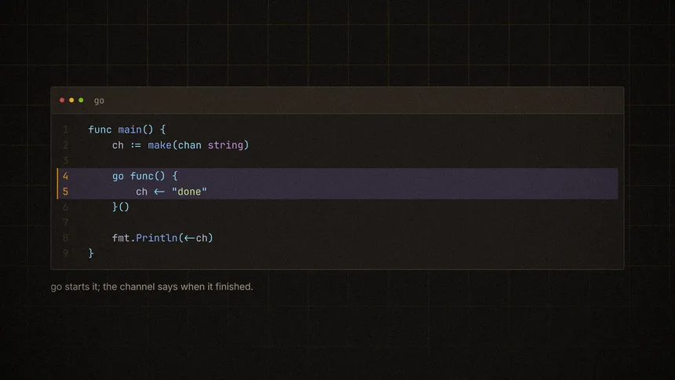<figcaption>dusk</figcaption></figure>
  <figure>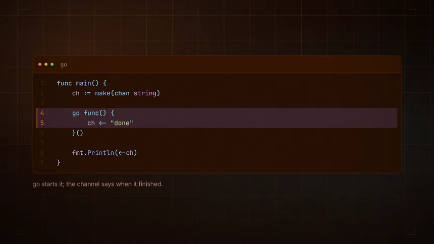<figcaption>hersie</figcaption></figure>
</div>

## Transitions

Five frames spanning a cut. The outgoing scene plays the first half of the move,
the incoming scene the second, both pushing the same way.

<figure class="wide">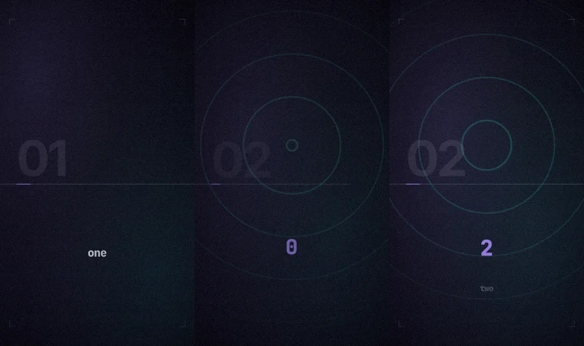<figcaption>fade</figcaption></figure>
<figure class="wide">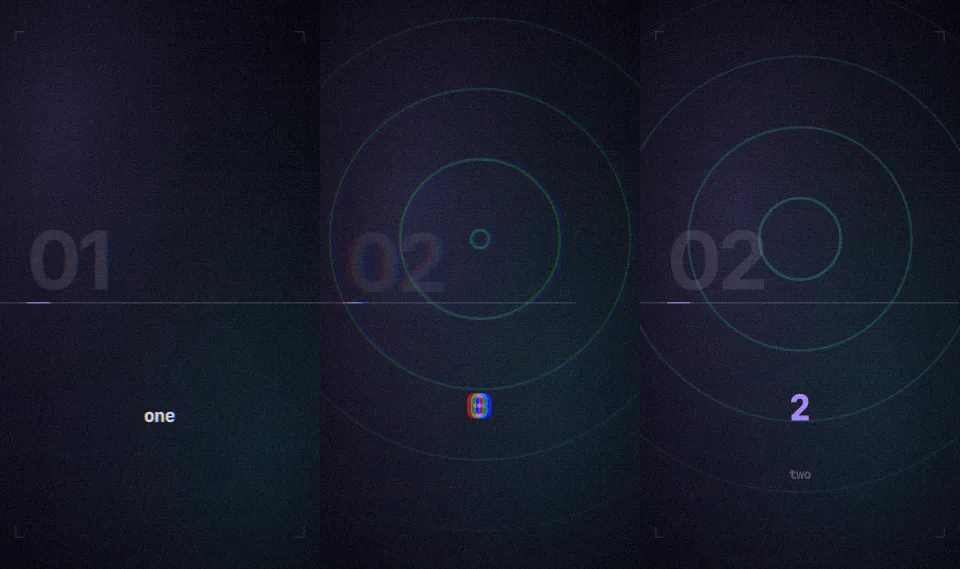<figcaption>glitch</figcaption></figure>
<figure class="wide">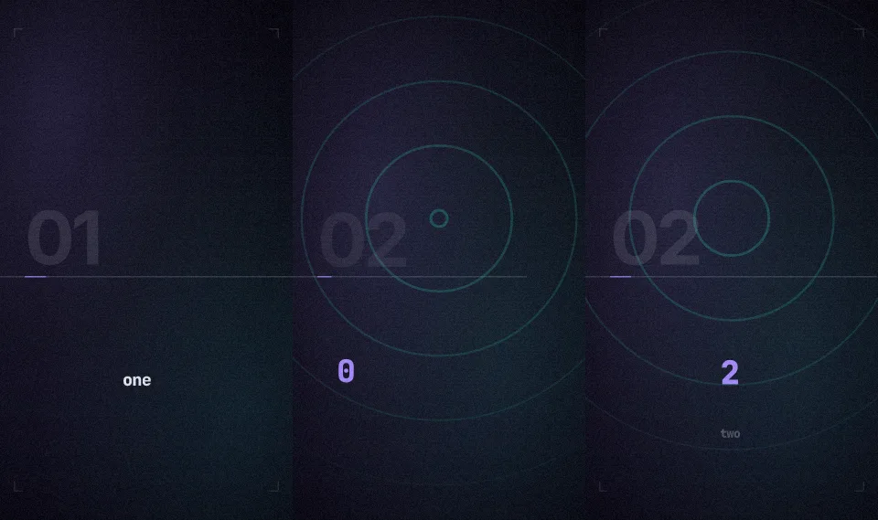<figcaption>slide</figcaption></figure>
<figure class="wide">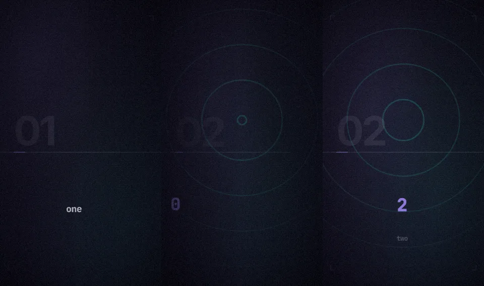<figcaption>whip</figcaption></figure>
<figure class="wide">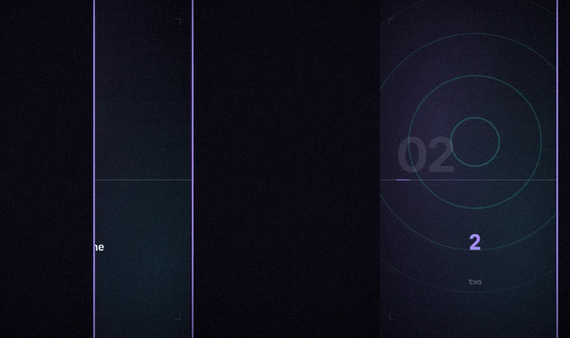<figcaption>wipe</figcaption></figure>

## One script, three shapes

Blocks size themselves from the stage, so the same scene renders to any canvas
without a second layout. Same taste, same scene, three canvases.

<div class="three">
  <figure>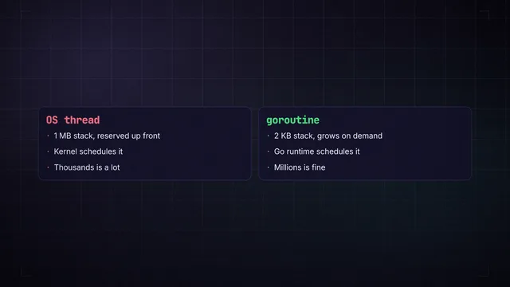<figcaption>horizontal</figcaption></figure>
  <figure>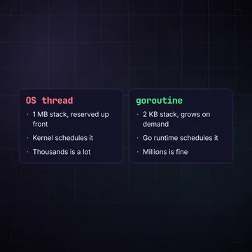<figcaption>square</figcaption></figure>
  <figure>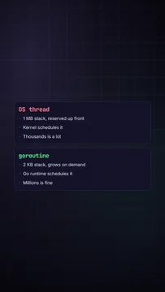<figcaption>vertical</figcaption></figure>
</div>

## Talking head

Three layouts for a recorded take. See [talking head](camera).

<div class="gallery">
  <figure>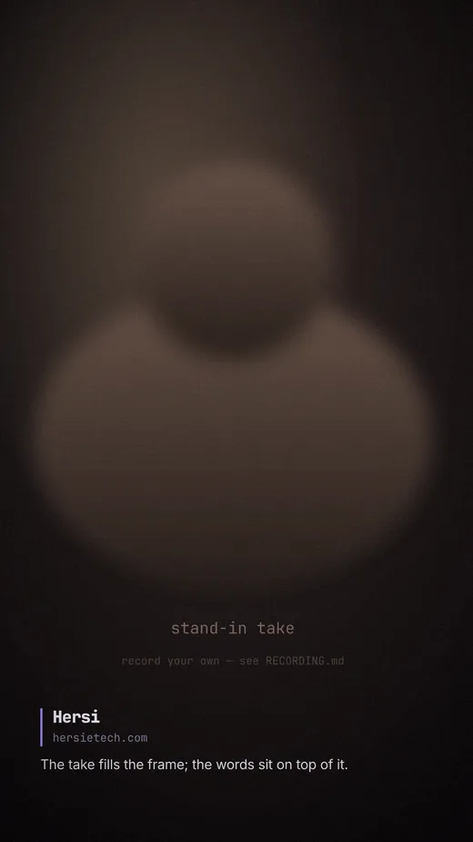<figcaption>full</figcaption></figure>
  <figure>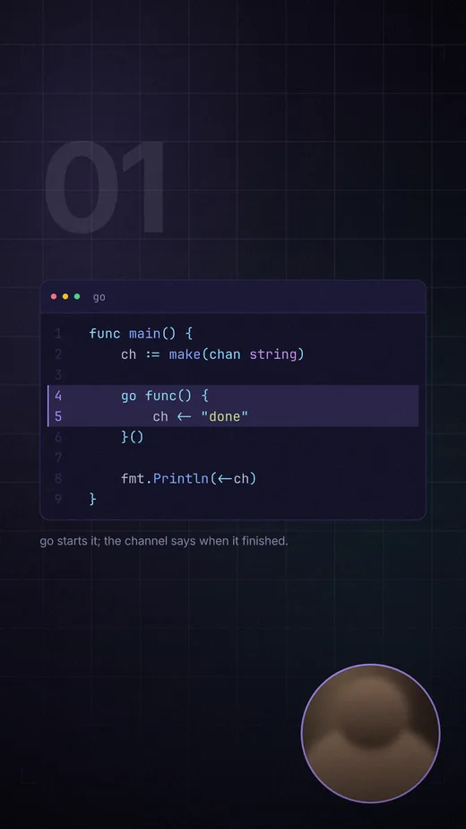<figcaption>pip</figcaption></figure>
  <figure>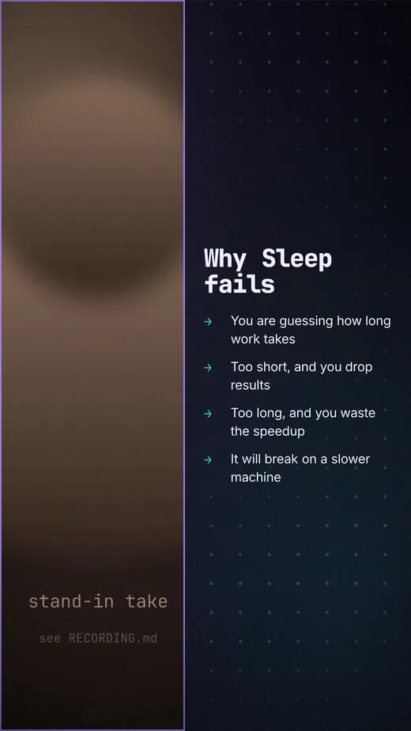<figcaption>split</figcaption></figure>
</div>

## The films

The long examples are too large to serve from this site. They render from the
repo in a couple of minutes:

```bash
bun stingo render examples/goroutines/video.yaml                  # 1080x1920
bun stingo render examples/goroutines/video.yaml --horizontal     # 1920x1080
```

Roughly five minutes, 53 scenes, every cut on a bar line.
